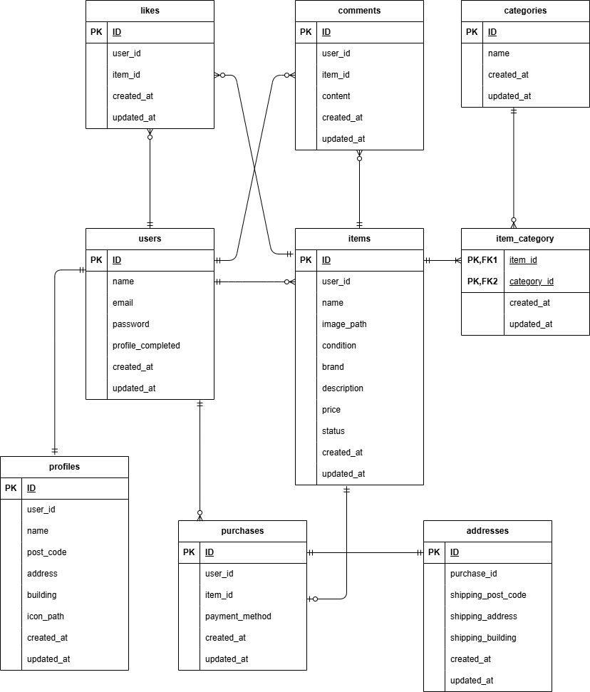

# coachtechフリマ

商品の出品と購入を行うことができるフリマアプリです。

## 環境構築

#### リポジトリをクローン

```
git clone git@github.com:ikemi-yuki/flea-market-app.git
```

#### Laravelのビルド

DockerDesktopアプリを立ち上げる

```
docker-compose up -d --build
```

#### Laravelパッケージのダウンロード

```
docker-compose exec php bash
```
```
composer install
```

#### .envファイルの作成

```
cp .env.example .env
```

#### .envファイルの修正

```
DB_HOST=mysql

DB_DATABASE=laravel_db

DB_USERNAME=laravel_user

DB_PASSWORD=laravel_pass
```

本アプリではStripe Checkoutを使用しています。<br>
Stripeのテスト用APIキーを `.env` に設定してください。

#### キー生成

```
php artisan key:generate
```

#### マイグレーション・ストレージリンク作成・シーディングを実行

```
php artisan migrate
```
```
php artisan storage:link
```
```
php artisan db:seed
```

## Featureテスト

※ Feature テストでは `demo_test` データベースを使用します。

#### .env.testing ファイルの作成

```
cp .env.testing.example .env.testing
```

#### .env.testing ファイルの修正

```
DB_PASSWORD=root
```

#### `demo_test` データベースの作成（ホスト側で実行）

```
docker-compose exec mysql bash
```
```
mysql -u root -p
```
```
CREATE DATABASE demo_test;
```
※ データベース作成時にエラーが出る場合は、
MySQLコンテナを再起動してください。

```
docker-compose restart mysql
```

#### キー生成・マイグレーション・テスト実行

```
php artisan key:generate --env=testing
```
```
php artisan migrate --env=testing
```
```
php artisan test
```

## Duskテスト

※ Dusk テストでは `laravel_dusk` データベースを使用します

#### .env.dusk.local ファイルの作成

```
cp .env.dusk.local.example .env.dusk.local
```

#### .env.dusk.local ファイルの修正

```
DB_PASSWORD=root
```

#### `laravel_dusk` データベースの作成（ホスト側で実行）

```
docker-compose exec mysql bash
```
```
mysql -u root -p
```
```
CREATE DATABASE laravel_dusk;
```
※ データベース作成時にエラーが出る場合は、
MySQLコンテナを再起動してください。

```
docker-compose restart mysql
```

#### キー生成・マイグレーション・テスト実行

```
php artisan key:generate --env=dusk.local
```
```
php artisan migrate --env=dusk.local
```
```
php artisan dusk
```

## 使用技術（実行環境）

フレームワーク: Laravel:8.83.8

言語：HTML CSS JavaScript PHP

Webサーバー: Nginx:1.21.1

データベース: MySQL:8.0.26

## ER図



## URL

アプリケーション：http://localhost/

phpMyAdmin：http://localhost:8080/
